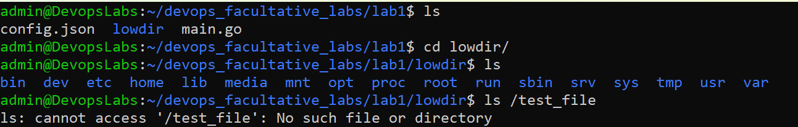
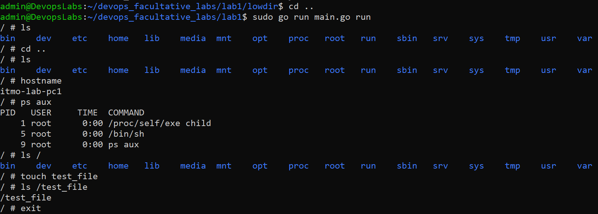
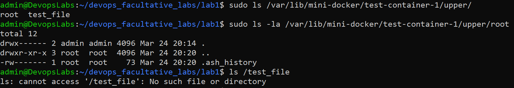

## Отчёт по лабораторной работе №1
### Вариант 2 продвинутого трека.
### Выполнила: Данилова Айаана.

## Ход работы
1) была поднята виртуальная машина на ядре убунту сервера через виртуалбокс так как у меня винда и ссш подключение к машине из терминала для удобства
2) скрипт на го с использованием библиотеки syscall для работы с системными вызовами, охватывающий все что по заданию надо было реализовать:
```text
логика разделена на два этапа:

Parent (основной процесс): Читает конфиг, создает дерево папок в /var/lib/mini-docker/{id} и монтирует слои через OverlayFS. Затем перезапускает сам себя, прокидывая флаги изоляции (Namespaces).

Child (изолированный процесс): Это уже «внутрянка» контейнера. Здесь меняется hostname, делается chroot в объединенную папку merged и монтируется /proc, чтобы работали команды типа ps.
```


### пример работы:

конфиг [config.json] из примера используется на этом этапе.
ожидаемое состояние после быстрого старта соглаcно [README.md]


можно пронаблюдать дефолтные папки и отсутствие файла test_file



запустили утилиту, так как у нас в конфиге прописана команда bin/sh по сути просто работаем с интерпретатором до тех пор пока не выйдем.
видно что имя хоста подтянулось с конфига а также айди процесса ребёнка 1 как и ожидалось.



созданная нами папка сохранилась внутри соответсвующей папки,
ура все работает.