# Отчет по лабораторной работе №2: Service Mesh

## Постановка лабы
Необходимо развернуть демонстрационный стенд с использованием выбранного решения Service Mesh и исследовать его базовые возможности:

1. подключение сервиса к mesh;
    
2. межсервисное взаимодействие;
    
3. Наблюдаемость;
    
4. Безопасность
    

По результатам выполнения лабораторной работы необходимо подготовить отчет, в котором должны быть представлены описание стенда, использованные конфигурационные файлы, результаты проверки работы Service Mesh и примеры различных сценариев взаимодействия между сервисами.

## Контекст


В качестве распределенной системы выступают два супер мега простых сервиса на FastAPI Python. 
```text
Service A (frontend) — прокси-сервис, который принимает запросы и пересылает их на Service B, возвращая клиенту статус ответа и полученные данные.
Service B (backend) — сервис данных, который отдаёт информацию о своей версии, причём в версии v1 намеренно задерживает ответ на 2 секунды, симулируя сетевую латентность.
```


Исходные коды, а также все манифесты, докер компос и т.д. располагаются [тут](./Src).


## Ход работы 
### Подготовка среды и настройка Service Mesh

После поднятия кластера было создано пространство имен `lab2` и применена метка `istio-injection=enabled`, активирующая механизм автоматического подселения 
Sidecar-контейнеров Envoy.


Был установлен Istio с профилем `demo`, что позволило развернуть входные/выходные шлюзы (Ingress и Egress Gateways), которые отвечают за маршрутизацию внешнего трафика.


В ходе подготовки возникла проблема с доступностью образов: образы, собранные в локальном Docker, не были видны внутри нод Minikube. Из-за особенностей мульти-нод архитектуры кластера стандартное переключение окружения через docker-env не сработало. Проблема была решена через команду minikube image load, которая принудительно скопировала образы на все узлы кластера.


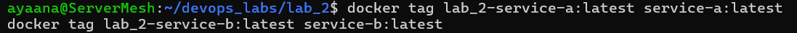


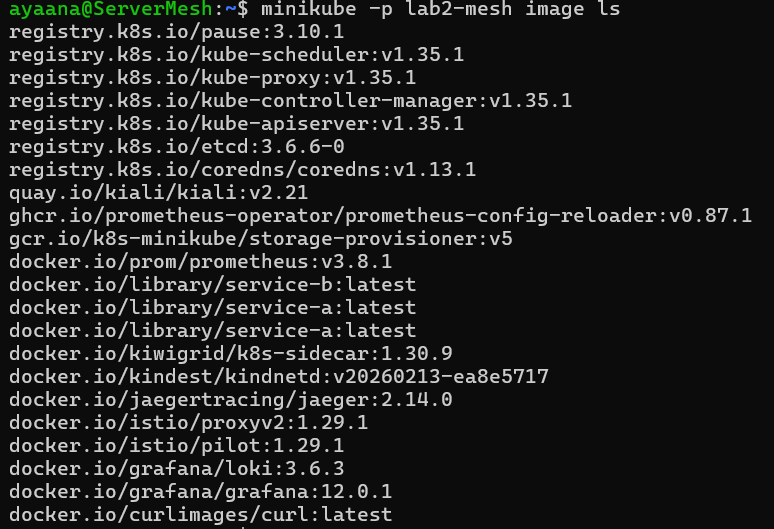


### Деплой приложения и настройка сети
Конфигурация была разделена на два этапа:

1. Инфраструктура

Развернуты стандартные Deployment и Service. Для реализации схемы Canary Deployment были одновременно запущены две версии бэкенда — v1 и v2.

2. Сетевые правила

Применены ресурсы Istio. Gateway был настроен для приема внешнего трафика, VirtualService — для разделения потоков данных между версиями, а DestinationRule — для изоляции этих версий и включения шифрования (mTLS).


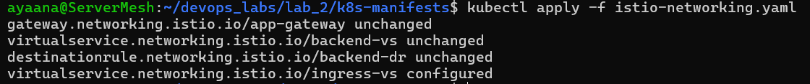
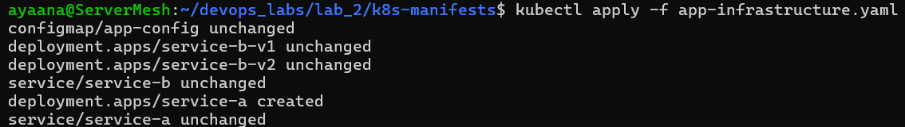


Ответ `READY 2/2` на команду 
```bash
kubectl get pods -n lab2
```
означает, что в каждом поде успешно работают два контейнера: само приложение на Python и прокси-сервер Envoy.


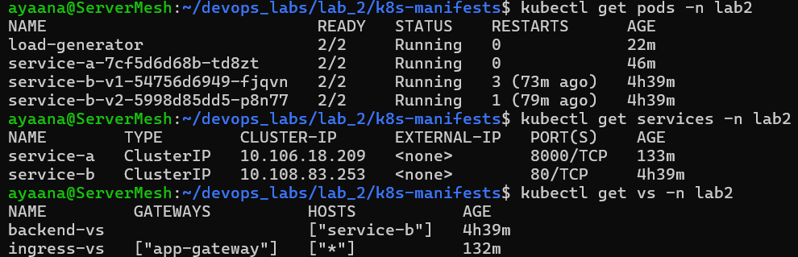

### Убедимся, что Service Mesh успешно взял на себя управлением сетью, безопасностью соединений и сборами метрик 

Активация механизмов наблюдаемости: 
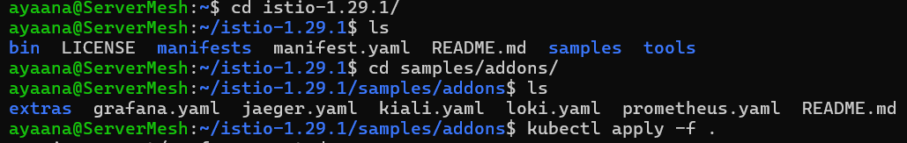
Проброс порта: 
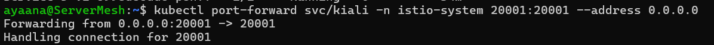
Подключение через терминал,обеспечивающее возможностью просматривать красивые анимации, если бы виртуалка была с графическим интерфейсом, то такого же исхода можно было бы добится командой 
```bash
istioctl dashboard kiali
```
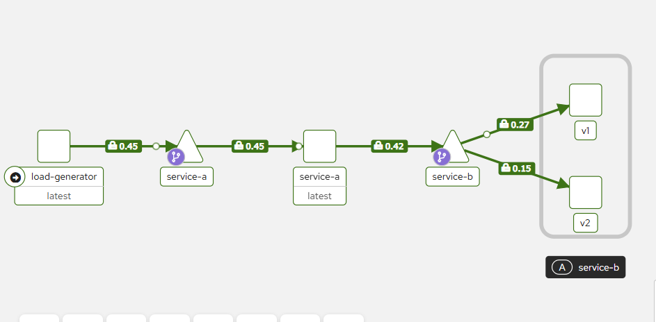
На скриншоте зафиксированы: 
-  Стабильный поток запросов от компонента load-generator к фронтенд-сервису service-a, который, в свою очередь, успешно транслирует запросы на бэкенд service-b.

- Наличие значков «замок» на каждой линии связи подтверждает активацию mTLS. Весь межсервисный трафик внутри пространства имен lab2 полностью зашифрован.

- Успешное прохождение трафика (индикация зеленым цветом) доказывает корректность работы кода на Python с использованием библиотеки httpx для проксирования запросов.

- Работа настроенных правил маршрутизации (VirtualService).

- Разделение входящего потока от service-a между двумя версиями бэкенда — v1 и v2.

- Разветвление стрелок после узла service-b доказывает, что Istio корректно идентифицирует подмножества, описанные в DestinationRule, и распределяет нагрузку согласно установленным весам.

- Цифровые показатели на ребрах графа отображают интенсивность запросов (RPS) в реальном времени, что позволяет визуально оценить равномерность распределения трафика.

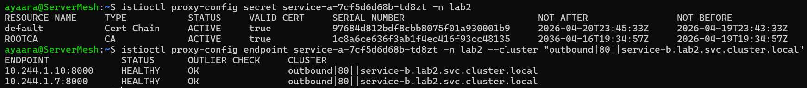

```bash
istioctl proxy-config secret
```
Относится к: Безопасность (Security)

Команда позволяет просмотреть состояние секретов (сертификатов и ключей) внутри Envoy-прокси. В текущем случае наличие активного ресурса default типа Cert Chain со статусом ACTIVE доказывает, что каждый под получил уникальный идентификатор и готов к установке защищенных mTLS-соединений.

```bash
istioctl proxy-config endpoint
```
Относится к: Наблюдаемость (Observability)

Команда отображает список всех сетевых адресов, которые прокси-сервер считает доступными для отправки трафика. В текущем случае статус HEALTHY для обоих IP-адресов сервиса service-b подтверждает, что Mesh-слой видит обе реплики приложения (v1 и v2) и собирает актуальные данные об их работоспособности.
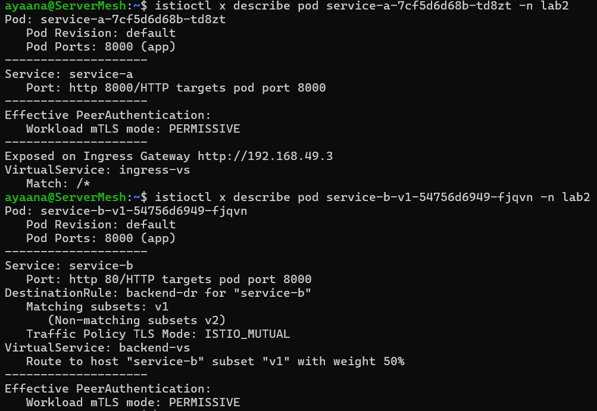
```bash
istioctl x describe
```
Относится к: Подключение сервиса к Mesh (Inclusion)

Команда выполняет статическую проверку ресурсов в выбранном пространстве имен на соответствие стандартам Istio. В текущем случае отсутствие ошибок подтверждает, что все манифесты синтаксически верны, а автоматическое внедрение sidecar-прокси настроено корректно.

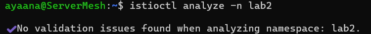
```bash
istioctl analyze
```
Относится к: Подключение сервиса к Mesh (Inclusion)

Команда выполняет статическую проверку ресурсов в выбранном пространстве имен на соответствие стандартам Istio. В текущем случае отсутствие ошибок (No validation issues) подтверждает, что все манифесты синтаксически верны, а автоматическое внедрение sidecar-прокси настроено корректно.


